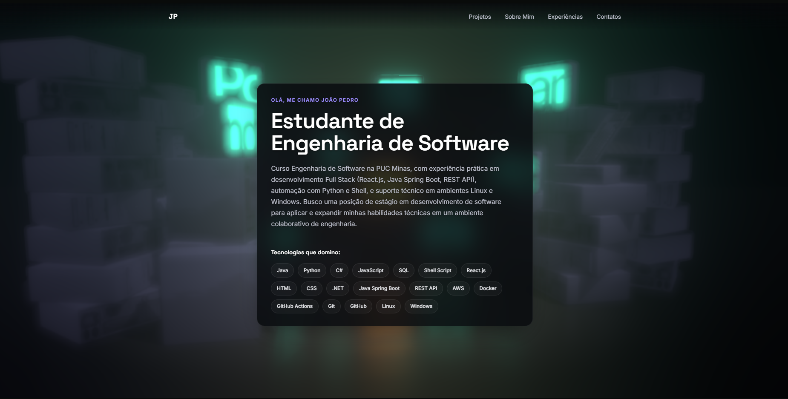
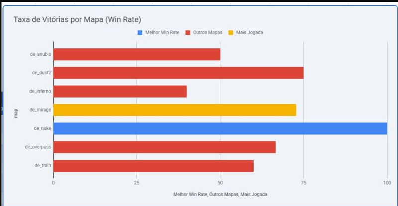
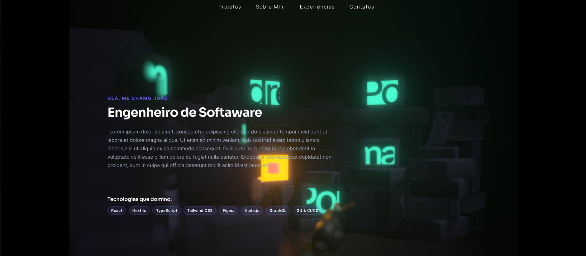
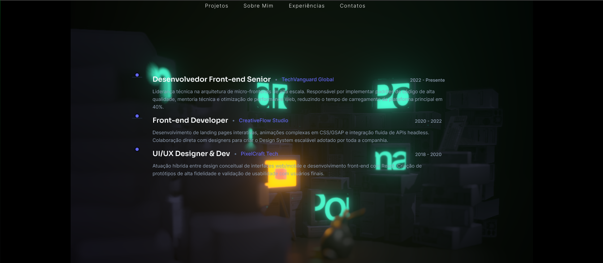
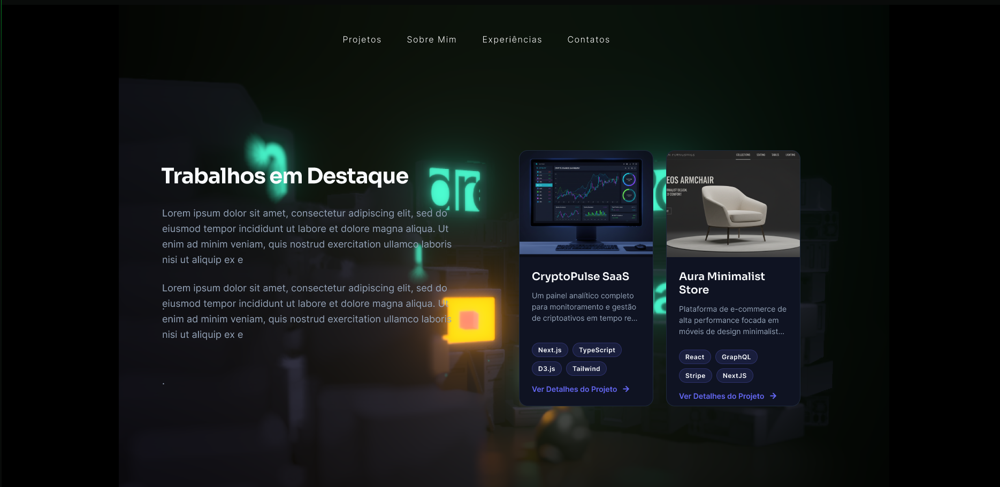
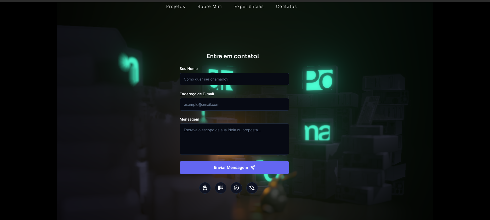
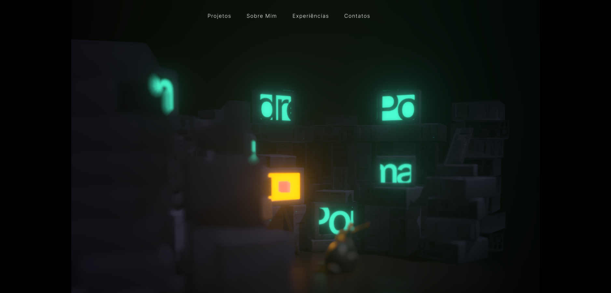

# Portifólio - João Pedro

Me chamo João Pedro Maciel de Oliveira e sou estudante de Engenharia de Software na PUC Minas. Este é o meu portfólio pessoal: uma página única reunindo meus projetos, experiências profissionais e um jeito de entrar em contato comigo.

Antes de sair codando, desenhei tudo no Figma. Os protótipos interativos estão em [`wireframe/links_uteis.MD`](wireframe/links_uteis.MD), pra quem quiser ver como o design evoluiu até virar código.

## Site Publicado

🔗 [meu-portifolio-react-ofhy0nvvd-joao-pedro-maciels-projects.vercel.app](https://meu-portifolio-react-ofhy0nvvd-joao-pedro-maciels-projects.vercel.app/#sobre-mim)

## Demonstração

### Portfólio em execução


### WebScraping + Data Analytics — CS2 Match Data


## Protótipos

### Landing Page / Hero


### Projetos


### Sobre Mim


### Experiências


### Contatos


## Funcionalidades

- A seção **Sobre Mim** tem um botão pra trocar entre português e inglês — traduzi o texto e os destaques na mão, sem usar biblioteca de i18n.
- **Projetos** e **Experiências** aparecem em linhas do tempo que se ordenam sozinhas por data, puxando os dados de `src/data/`. Pra adicionar algo novo, basta editar esses arquivos.
- O formulário de **Contato** manda e-mail de verdade (via EmailJS) e valida nome, e-mail e mensagem antes de enviar, mostrando o erro na hora, embaixo do campo.
- O fundo é uma cena 3D em tela cheia, sempre atrás do conteúdo — adaptei o exemplo ["Monitors"](https://pmndrs.github.io/examples/examples/monitors) do pmndrs (uma pilha de monitores CRT antigos com reflexo no chão e bloom) usando `@react-three/fiber`, `@react-three/drei` e `@react-three/postprocessing`.
- Como o fundo é bem vivo, coloquei painéis de vidro fosco (`content-panel`, com `backdrop-filter: blur()`) atrás de cada bloco de texto pra manter a leitura confortável sem precisar escurecer a cena.
- Bio, projetos e experiências são reais — é o meu currículo mesmo, só que em forma de site.

## Tecnologias

- **React 19** + **TypeScript**
- **Vite** — build e dev server
- **Three.js**, **@react-three/fiber**, **@react-three/drei** e **@react-three/postprocessing** — cena 3D do background (ver referência em [`wireframe/links_uteis.MD`](wireframe/links_uteis.MD))
- **@emailjs/browser** — envio do formulário de contato direto do navegador, sem backend
- **ESLint** (`typescript-eslint`, `eslint-plugin-react-hooks`, `eslint-plugin-react-refresh`) — lint do projeto
- CSS puro, sem framework de estilos

## Estrutura do site

A aplicação fica em `portifolio/`. O `App.tsx` só encaixa as seções em sequência, uma depois da outra:

```
Background → Nav → Hero → Projetos → SobreMim → Experiencias → Contatos
```

```
portifolio/
├── src/
│   ├── App.tsx              # composição das seções da página
│   ├── components/
│   │   ├── Background/       # cena 3D de fundo (Canvas, Scene, monitores, assets .glb/.woff)
│   │   └── Nav/
│   ├── sections/              # uma pasta por seção (Hero, Projetos, SobreMim, Experiencias, Contatos)
│   │   └── <Secao>/
│   │       ├── <Secao>.tsx
│   │       └── <Secao>.css
│   └── data/                  # conteúdo tipado usado pelas seções (projects.ts, experience.ts)
└── public/
```

Cada seção corresponde a uma âncora de navegação (`#projetos`, `#sobre-mim`, `#experiencias`, `#contatos`), usada pelos links do `Nav`.

## Uso

É tudo página única: os links do menu no topo (`Projetos`, `Sobre Mim`, `Experiências`, `Contatos`) fazem scroll até a seção correspondente. Em tela estreita, o menu vira um hambúrguer. Se você só quer visitar o site publicado, não precisa configurar nada — a seção "Rodando o projeto" abaixo é só para quem quiser rodar ou editar o código localmente.

## Rodando o projeto

```bash
cd portifolio
npm install
```

Para o formulário de contato mandar e-mail de verdade, copie `portifolio/.env.example` para `portifolio/.env` e preencha com as credenciais de uma conta gratuita no [EmailJS](https://www.emailjs.com/) (`VITE_EMAILJS_SERVICE_ID`, `VITE_EMAILJS_TEMPLATE_ID`, `VITE_EMAILJS_PUBLIC_KEY`). Sem isso o site roda normalmente do mesmo jeito, só o envio do formulário que não funciona.

```bash
npm run dev
```

Outros scripts disponíveis: `npm run build`, `npm run lint`, `npm run preview`.

## Deploy

O site está no ar pela Vercel — build estático via Vite, sem backend:

1. Crie uma conta na [Vercel](https://vercel.com/) e importe este repositório do GitHub.
2. A Vercel já reconhece o Vite sozinha — só confirme se o *Root Directory* está como `portifolio/`, o build command como `npm run build` e o output directory como `dist`.
3. Antes do primeiro deploy, cadastre as variáveis de ambiente em **Project Settings → Environment Variables**: `VITE_EMAILJS_SERVICE_ID`, `VITE_EMAILJS_TEMPLATE_ID` e `VITE_EMAILJS_PUBLIC_KEY` (os mesmos valores do `.env` local — ver seção acima). Repare no prefixo `VITE_`: sem ele o Vite não expõe a variável para o navegador, e o formulário falha sem avisar por quê.
4. Depois disso é só push na branch principal — cada um gera um deploy novo automaticamente.
